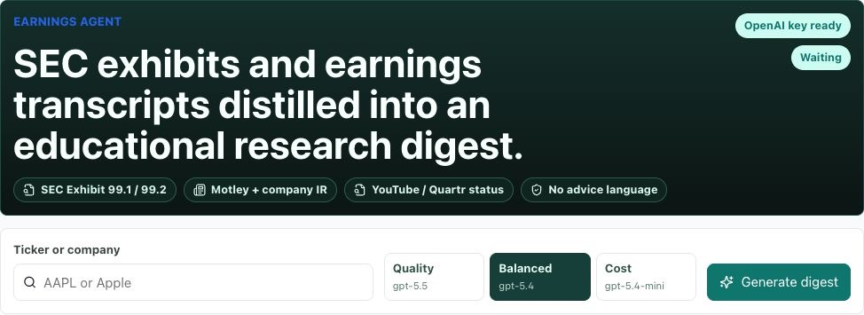
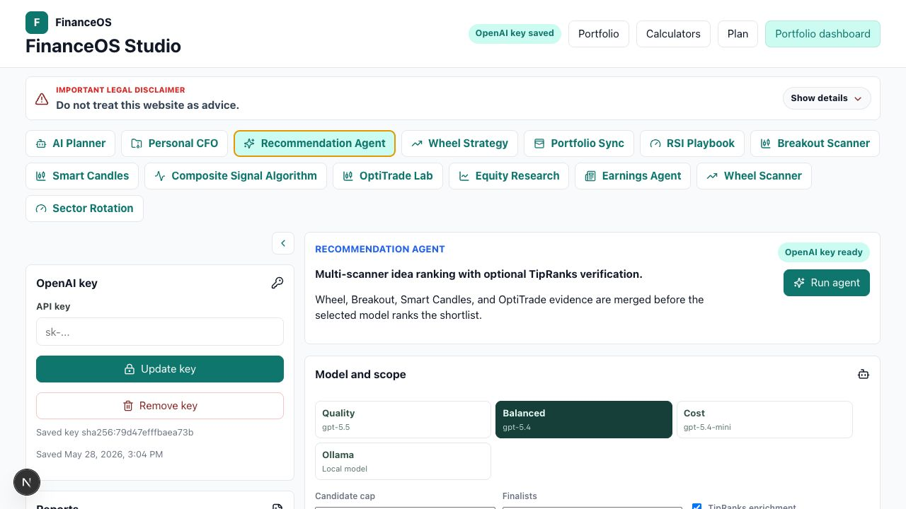
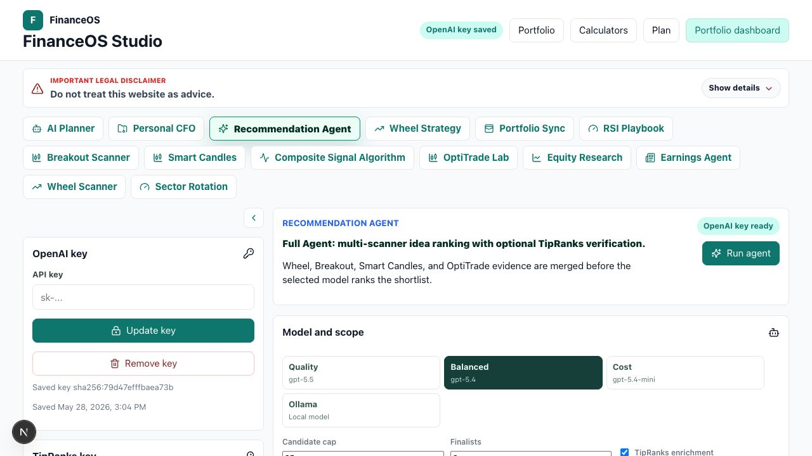
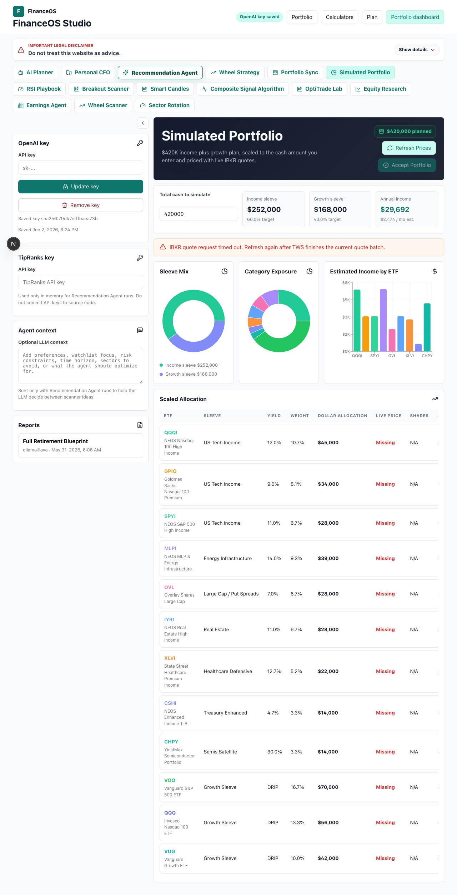
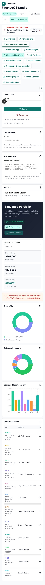
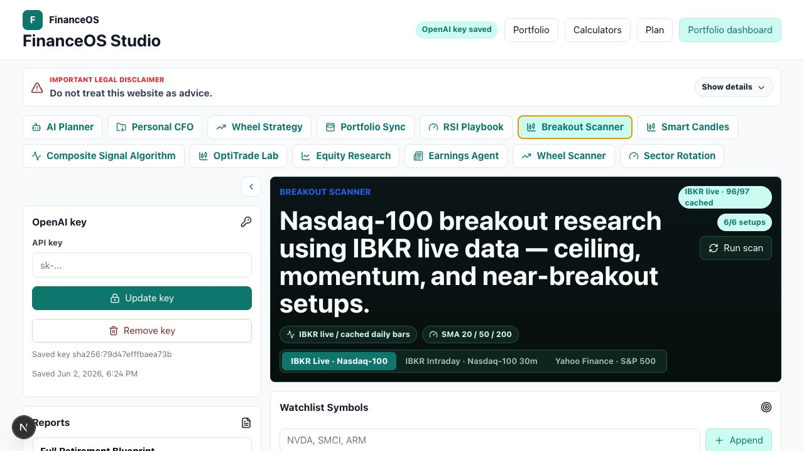
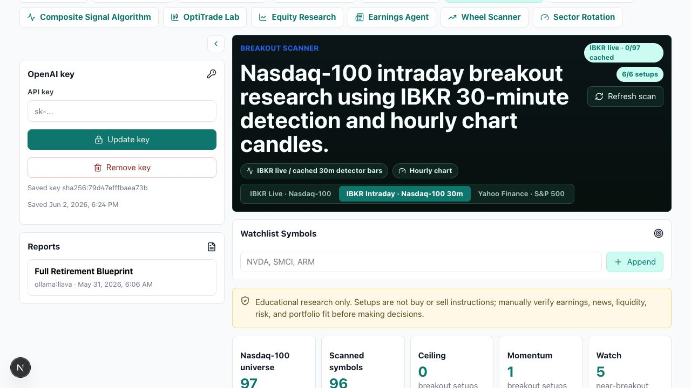

# FinanceOS

[](LICENSE)
[](https://github.com/dakshk11/personal_finance/stargazers)
[](https://github.com/dakshk11/personal_finance/commits/main)
[](CONTRIBUTING.md)

**An open-source, AI-powered personal finance command center** — direct indexing, tax-loss harvesting, retirement planning, options research, equity analysis, and AI-assisted planning workflows, all in one self-hosted platform.

FinanceOS is a simulation-only household personal finance command center for planning, portfolios, market research, and advisor workflows. It includes tax-aware portfolio analysis, direct indexing, tax-loss harvesting research, portfolio transition planning, 13F manager research, retirement income analysis, AI-assisted planning workflows, equity research, earnings research, and educational options research.

The product is designed to help users understand tradeoffs before taking action: tracking error versus tax-loss value, taxable account transitions versus embedded gains, individual-stock valuation versus cost basis, Roth conversion windows versus future RMD pressure, and retirement spending needs versus portfolio durability.

> Important: FinanceOS is educational planning software only. It is not a registered investment adviser, broker-dealer, law firm, CPA firm, tax preparer, fiduciary, custodian, or trading system. Outputs are hypothetical and must not be treated as tax, legal, accounting, investment, fiduciary, brokerage, or trading advice.


## Product Modules

| Module | What it helps users do |
| --- | --- |
| Portfolio Dashboard | Build simulated direct-index portfolios, compare models, run backtests, review tax-loss harvesting candidates, and manage exclusions. |
| Portfolio Analyzer | Enter existing holdings, shares, and cost basis; cache daily prices; review unrealized gain/loss; and compare forward P/E against 5-year and 10-year averages. |
| Portfolio Sync | Connect brokerage accounts read-only through SnapTrade, sync holdings snapshots, review aggregate exposure, cost basis, P/L, sector mix, and concentration warnings. |
| Advisor Workspace | Import a taxable legacy account, define transition constraints, produce proposal-ready transition plans, and export CSV recommendations. |
| Retirement Analyzer | Model retirement income, spending, tax-aware withdrawal order, Roth conversions, cash/bond/growth buckets, state taxes, and shortfall risk. |
| Ideas Workspace | Review self-managed investor playbooks for sector ETF TLH, asset location, retirement buckets, TIPS ladders, charitable giving, Roth windows, and rebalancing bands. |
| Research Center | Explain the methodology, tax-loss harvesting assumptions, wash-sale safeguards, model design, and source references in plain language. |
| 13F Research | Search investment managers, watch filings, download holdings, and simulate copycat performance from SEC 13F data. |
| FinanceOS Studio | Save an encrypted OpenAI API key, choose OpenAI or Ollama for eligible workflows, generate AI Planner reports, run Personal CFO projects, review Recommendation Agent ideas, Simulated Portfolio plans, Wheel Strategy, RSI Playbook, Breakout Scanner, Smart Candles, Sector Rotation, Composite Signal Algorithm, OptiTrade Lab, Portfolio Sync, Equity Research, Earnings Agent digests, and the live IBKR Wheel Scanner. |
| Recommendation Agent | Combine Wheel Scanner, Breakout Scanner, Smart Candles, and OptiTrade Lab candidates, optionally enrich finalists with TipRanks, and rank educational research ideas with user context and OpenAI or Ollama. |
| Simulated Portfolio | Scale a `$150K` income plus growth ETF recipe to a user-entered cash amount, fetch Yahoo Finance quotes, save hypothetical trades, and refresh saved price snapshots. |
| Wheel Strategy | Run a daily educational wheel-strategy scan for S&P 500 top holdings, Nasdaq top holdings, core ETFs, and leveraged ETFs using live yfinance option chains when available. |
| Wheel Scanner / IBKR Labs | Standalone IBKR backend on port 8002 powers the live Nasdaq-100 + leveraged ETF Wheel Scanner, Composite Signal Algorithm, OptiTrade Lab, and IBKR-backed Breakout Scanner. Wheel data falls back to CBOE delayed prices when TWS is offline; historical-bar tools require a clean TWS connection. |
| RSI Playbook | Combine Wheel Strategy and Portfolio Sync symbols, compute RSI/EMA history, and map every stock to the requested RSI action zone with chart details. |
| Breakout Scanner | Scan IBKR Nasdaq-100 live/cache data by default, or Yahoo Finance S&P 500 data, for ceiling breakouts, momentum breakouts, near-breakout watch setups, intraday refreshes, relative-volume context, candlestick charts, and backtest context. |
| Smart Candles | Educational FinanceOS Smart Candle Signals tab that classifies latest daily candles as blue, pink, red, or neutral using transparent OHLCV, RSI, trend, volume, and reversal/distribution rules. |
| Sector Rotation | Compare sector-rotation scenarios, live allocation ideas, accepted allocations, rebalance status, and historical selection context. |
| Composite Signal Algorithm | IBKR historical-bar lab for SOXL, TQQQ, and UPRO using underlying ETF proxies and monthly trend/momentum/RSI components. |
| OptiTrade Lab | IBKR historical-bar leveraged ETF signal cockpit with trend regime, anti-chop filtering, ATR/swing stops, take-profit modeling, charts, and settings-aware backtests. |
| Equity Research | Enter a ticker or company, pull free market and five-year financial data, run peer/DCF context, and generate an educational Wall Street-style research stance. |
| Earnings Agent | Resolve a ticker or company, fetch recent SEC earnings exhibits, company IR slides/remarks, and matching transcript coverage, then use the encrypted OpenAI key to create an educational digest. |

## Screenshots

### Portfolio Dashboard

The dashboard is the operational hub for direct-index simulation. Users can create a portfolio, choose a benchmark index, run backtests, compare direct-indexing models, import holdings and tax lots, and review TLH output before any real-world decision.


### Portfolio Analyzer

The portfolio analyzer is for users who want a professional review surface for existing holdings without building a direct-index portfolio first. Users enter positions, shares, and cost basis, then review market value, weight, unrealized gain/loss, forward P/E, 5-year and 10-year forward P/E averages, valuation signals, and the data source used for each row.


### Retirement Analyzer

The retirement analyzer combines account inputs, current income, retirement spending, tax assumptions, state details, Social Security, pension income, Natural Retirement Spending Smile, Roth conversion analysis, and withdrawal sequencing.


### Advisor Workspace

The advisor workspace focuses on taxable account transition proposals. It supports imported holdings, imported tax lots, client constraints, annual gain budgets, maximum tracking error, maximum active share, exclusion rules, and proposal export.


### Research Center

The research page explains the methodology behind the product so users can understand what the model is doing, where the assumptions come from, and why the output is still only a planning artifact.


### Ideas Workspace

The ideas workspace organizes self-managed investor concepts into reviewable tabs. Current playbooks include sector ETF tax-loss harvesting, core plus TLH sleeves, asset location, retirement buckets, TIPS ladders, charitable giving with DAF/QCD workflows, Roth conversion windows, and threshold-based rebalancing.


### FinanceOS Studio

FinanceOS Studio brings together encrypted OpenAI-key workflows, optional Ollama model selection, AI Planner reports, Personal CFO, Recommendation Agent, Simulated Portfolio, Portfolio Sync, Wheel Strategy, RSI Playbook, Breakout Scanner, Smart Candles, Sector Rotation, Composite Signal Algorithm, OptiTrade Lab, Equity Research, Earnings Agent, and the IBKR Wheel Scanner in one research workspace.



### Recommendation Agent

Recommendation Agent pulls candidates from Wheel Scanner, Breakout Scanner, Smart Candles, and OptiTrade Lab, then ranks finalists as educational research ideas using OpenAI or Ollama. Users can add decision context, current-portfolio context, and an in-memory TipRanks key for optional enrichment.





### Simulated Portfolio

The Simulated Portfolio tab scales a `$150K` income plus growth ETF recipe to the user's cash amount, refreshes Yahoo Finance quote snapshots, saves hypothetical trades, and can refresh saved portfolio prices later.





### IBKR Breakout Intraday

The IBKR-backed Breakout Scanner can inspect intraday context and refresh hourly bars when the IBKR backend and TWS/Gateway historical-bar access are available.





For a longer feature walkthrough, see [docs/USABILITY_GUIDE.md](docs/USABILITY_GUIDE.md).

## Core Capabilities

- Direct-index portfolio simulation for supported indices including `XLG`, `SPY`, `TOPT`, and `QTOP`.
- Existing portfolio analyzer for self-managed investors with:
  - User-entered tickers, shares, and cost basis per share
  - Daily close price cache by symbol and analysis date
  - Market value, portfolio weight, unrealized gain/loss, and cost-basis review
  - Forward P/E comparison against 5-year and 10-year averages
  - Clear source labels when price data and valuation data come from different sources
- Tax-loss harvesting review in conservative, moderate, and aggressive modes.
- Direct-indexing model comparison:
  - Risk-score optimizer
  - Threshold throttle
  - Peer basket replacement
  - Completion ETF sleeve
- Backtests with benchmark comparison, tracking difference, tracking error, harvested losses, estimated tax impact, tax-adjusted result, trade count, cap usage, and warnings.
- Portfolio import workflow for holdings and tax lots.
- Advisor transition proposals with gain budgets, tracking constraints, active-share constraints, client exclusions, household wash-sale notes, and CSV export.
- SEC 13F workflow for manager search, watch creation, filing refresh, holdings download, and copycat performance simulation.
- FinanceOS Studio workspace with:
  - Encrypted user-owned OpenAI API key storage
  - OpenAI model choices for API-backed workflows and Ollama local-model selection for supported AI Planner and Recommendation Agent flows
  - Saved retirement-planning report history
  - Personal CFO project workspace with a seven-phase interview, editable markdown files, optional financial CSV upload, dashboard summaries, generated one-pager, and one refinement round
  - Recommendation Agent tab that merges Wheel Scanner, Breakout Scanner, Smart Candles, and OptiTrade Lab candidates, applies optional current-portfolio and decision context, optionally enriches finalists with TipRanks, and returns ranked educational research ideas
  - Simulated Portfolio tab that scales a `$150K` income plus growth ETF recipe to user-entered cash, fetches Yahoo Finance quote snapshots, saves hypothetical trades, and refreshes saved prices later
  - Smart Candles tab with explainable blue/pink/red/neutral daily-candle classifications, candlestick charts, rule components, custom watchlists, and forward-return backtest distributions
  - Breakout Scanner tab that defaults to IBKR Nasdaq-100 live/cache data, supports Yahoo Finance S&P 500 scans, and renders candlestick/intraday charts with SMA/resistance/volume context
  - Sector Rotation tab for scenario comparison, live allocation review, accepted allocation tracking, rebalance status, and selection history
  - Composite Signal Algorithm and OptiTrade Lab tabs powered by the IBKR backend historical-bar endpoints
  - Equity Research tab that combines yfinance profile/valuation data, five-year financial statement rows, same-sector peer context, a simple DCF model, recent earnings source metadata, and a saved educational research stance
  - Earnings Agent tab that resolves tickers/company names, fetches recent SEC 8-K Exhibit 99.1/99.2 earnings materials, company investor-relations slides/prepared remarks, and Motley Fool transcript coverage when available, and saves educational digest history
- Portfolio Sync workspace with:
  - Read-only SnapTrade connection workflow for brokerage accounts
  - Browser-entered SnapTrade client id and consumer key setup for local use, with the consumer key encrypted in the backend database
  - Encrypted per-user SnapTrade `userSecret` storage and immutable provider user id `directindex-user-{user.id}`
  - Setup-required state when SnapTrade provider credentials are missing; no fake brokerage connection is shown
  - Holdings normalization into Portfolio Analyzer-compatible symbol, shares, cost-basis, market-value, account, and brokerage fields
  - Aggregate market value, total cost basis, unrealized gain/loss, sector exposure, top holdings P/L, missing cost-basis warnings, single-position warnings above 10%, and sector warnings above 25%
  - Manual Portfolio Analyzer remains available for users without SnapTrade credentials
- RSI Playbook workspace with:
  - Combined stock list from Wheel Strategy plus the latest Portfolio Sync holdings snapshot
  - Daily RSI 14 and EMA 8/21/55 calculations using cached market history
  - Requested action zones: RSI 70+ go to cash, RSI 55-65 sell puts far OTM, RSI 45-55 sell puts ATM, RSI 30-45 buy the stock, and RSI 30 and below buy LEAP aggressively
  - Per-symbol summary table and click-through chart details with price, EMA overlays, RSI bands, source labels, and manual-verification notes
- Breakout Scanner workspace with:
  - IBKR Nasdaq-100 + leveraged ETF scan path by default, with Yahoo Finance S&P 500 scan/backtest path available
  - Breakout-specific OHLCV cache for high/low/volume data without changing the close-only price cache
  - Ceiling breakout, momentum breakout, and near-breakout watch detectors using resistance touches, relative volume, SMA trend context, intraday bar context, and liquidity filters
  - Ranked setup table, click-through candlestick/SMA/resistance/volume chart, hourly refresh controls where available, and Backtest Lab distributions for 5/10/20/60 trading-day forward returns
- Smart Candles workspace with:
  - S&P 500 plus custom-watchlist scan using the shared OHLCV cache
  - Transparent candle-color approximation rules for blue accumulation/reversal, pink caution/distribution, red breakdown, and neutral candles
  - Candlestick chart with SMA and volume overlays plus color-specific backtest distributions
- IBKR research labs with:
  - Composite Signal Algorithm endpoint for monthly SOXL/TQQQ/UPRO trend research using SOXX/QQQ/SPY proxies
  - OptiTrade Lab endpoints for leveraged ETF signal packages and settings-aware backtests
  - IBKR Breakout Scanner status and scan endpoints for Nasdaq-100 plus leveraged ETF intraday/historical-bar research
  - Local process guardrails to avoid duplicate TWS client-id connections
- Wheel Strategy workspace with:
  - Daily scan universe built from S&P 500 top holdings, Nasdaq top holdings, plus `QQQ`, `SPY`, `SMH`, `XLE`, `XLI`, `UPRO`, `TQQQ`, and `SOXL`
  - yfinance option-chain adapter for 30-45 DTE cash-secured put candidates
  - Black-Scholes delta calculation using live implied volatility
  - TradeGemini-inspired review checks for premium yield, RSI, Bollinger Band %, IV rank proxy, earnings window, open interest, bid/ask spread, single-name exposure, and sector exposure
  - Deep Dive Summary panel that ranks research priorities without using buy/sell advice language
  - Wheel lifecycle tracking for 50% profit alerts, assignment review, covered-call candidate alerts, and roll eligibility only under 14 DTE when net credit is available
- Self-managed investor ideas workspace with:
  - Sector ETF tax-loss harvesting sleeve and replacement ETF examples
  - Asset location review across taxable, tax-deferred, Roth, and HSA-style accounts
  - Retirement cash, bond, and growth bucket planning
  - TIPS ladder income-floor planning
  - Charitable giving stack for appreciated securities, donor-advised funds, and QCD review
  - Roth conversion and threshold-based rebalancing playbooks
- Retirement planning workflow with:
  - Taxable, tax-deferred, Roth/HSA, and cash account inputs
  - Saved user inputs in the local workspace
  - Current income less federal and current-state tax until retirement
  - Natural Retirement Spending Smile projection
  - State and federal tax assumptions
  - Tax-aware withdrawal sequencing
  - Roth conversion amount, tax funding, and reasoning
  - Roth conversion tax-savings sandbox using the user's current effective tax rate
  - Cash/T-bill, bond, and growth bucket guidance
  - Configurable detailed cash-flow table, defaulting to at least 36 rows
  - Annual spending funding mix by stable income, taxable, tax-deferred, Roth, cash, and shortfall
  - Effective tax-rate estimate from selected federal and state assumptions
  - Life-event, family gifting, and estate-plan prompts

## Tech Stack

- Frontend: Next.js, React, TypeScript, Recharts, Lucide icons
- Backend: FastAPI, SQLAlchemy, Pydantic, Argon2 password hashing
- Data and jobs: PostgreSQL, Redis, Celery
- Market, option, and filing data: Stooq daily close data, yfinance valuation and option-chain data when available, cached provider data, SEC filing downloads, and deterministic fallback data when providers are unavailable
- Local environment: Docker Compose

## Project Structure

```text
.
├── backend/                  Main FastAPI app, services, models, schemas, tests
│   └── ibkr/                 Standalone IBKR research backend (port 8002)
│       ├── main.py           FastAPI app — status, watchlist, options, scanners, labs, WebSocket
│       ├── config.py         Pydantic settings (TWS host/port, CBOE URL, cache TTLs)
│       ├── start.sh          Single-instance launcher that cleans stale TWS client-id workers
│       ├── requirements.txt  Python deps including ib_insync
│       ├── .env.example      Environment template (copy to .env before starting)
│       ├── data/
│       │   ├── tickers.py    Nasdaq-100 + leveraged ETF universe
│       │   └── cboe_daily_cache.json  Persistent daily option-chain cache
│       └── services/
│           ├── ibkr_service.py       TWS connection, contract qualification, snapshot poll
│           ├── cboe_service.py       CBOE chain fetch, parse, disk+memory cache
│           ├── analytics_service.py  RSI(14) and BB%(20) from IBKR daily bars
│           └── scanner_service.py    CSP and CC filter logic
├── frontend/                 Next.js app and shared API client
├── docs/
│   ├── USABILITY_GUIDE.md    Product walkthrough and demo guide
│   ├── PORTFOLIO_SYNC.md     SnapTrade read-only sync behavior, API, setup, and tests
│   ├── EARNINGS_AGENT.md     SEC/company IR/Motley source retrieval, digest API, storage, and tests
│   ├── RSI_PLAYBOOK.md       RSI Playbook rules, API, chart data, and test notes
│   ├── BREAKOUT_SCANNER.md   Breakout detection, OHLCV cache, backtest lab, and test notes
│   ├── WHEEL_STRATEGY.md     Wheel Strategy behavior, API, scoring, and test notes
│   └── screenshots/          README and guide screenshots
├── docker-compose.yml        Local Postgres, Redis, backend, worker, beat, frontend
├── .env.example              Local environment template
└── README.md
```

## Clone or Fork

To run locally from GitHub:

```bash
git clone https://github.com/dakshk11/personal_finance.git
cd personal_finance
cp .env.example .env
docker compose up --build
```

Or fork the repository in GitHub first, then clone your fork:

```bash
git clone https://github.com/<your-username>/personal_finance.git
cd personal_finance
cp .env.example .env
docker compose up --build
```

This starts all services including the IBKR research backend on port 8002. No extra steps are needed for delayed Wheel Scanner data. Composite Signal Algorithm, OptiTrade Lab, and IBKR historical-bar features require TWS/Gateway to be running with API access enabled.

## Quickstart

Requirements:

- Docker Desktop or a compatible Docker engine
- Docker Compose

Run the full local stack (includes the IBKR research backend):

```bash
cp .env.example .env
docker compose up --build
```

Open:

- Frontend: http://localhost:3000
- Backend API docs: http://localhost:8000/docs
- Health check: http://localhost:8000/health
- IBKR research API: http://localhost:8002/api/status
- IBKR research docs: http://localhost:8002/docs

All seven services start together: `db`, `redis`, `backend`, `worker`, `beat`, `frontend`, and `ibkr-backend`.

**Linux users:** `host.docker.internal` is not available by default. The `docker-compose.yml` includes `extra_hosts: host.docker.internal:host-gateway` which enables it on Linux with Docker Engine 20.10+. If TWS still cannot be reached, set `TWS_HOST` in your `.env` to your machine's LAN IP instead:

```
TWS_HOST=192.168.1.x   # replace with your actual LAN IP
```

Local demo workspace:

- Login is currently disabled for local development. The backend automatically uses a shared local demo user when no valid session cookie is present.
- The seeded test account email defaults to `local-demo@financeos.local`.
- No default reusable seeded password is documented or committed. If `TEST_ACCOUNT_PASSWORD` is blank or unset, the backend generates an in-memory random local password at startup.

The test account is seeded on backend startup when `SEED_TEST_ACCOUNT=true`. Restore a real login requirement and disable local demo defaults before using the project outside local development.

To stop the stack:

```bash
docker compose down
```

To stop the stack and remove local database/cache volumes:

```bash
docker compose down -v
```

## Using FinanceOS Studio

Open http://localhost:3000/ai-advisor after the stack starts. Local development uses the shared demo workspace unless strict authentication is re-enabled.

Common workflows:

- **AI Planner:** Save an OpenAI key in the left sidebar, or choose Ollama and enter a local model/base URL. Complete every required field in one planner module, then generate a saved retirement-planning report.
- **Recommendation Agent:** Optionally enter a TipRanks key and decision context in the sidebar, open the Recommendation Agent tab, add current-portfolio context if useful, choose OpenAI or Ollama, and run the agent. Results are ranked educational research ideas built from scanner evidence; they are not trading instructions.
- **Simulated Portfolio:** Open Simulated Portfolio, enter the cash amount to model, refresh Yahoo Finance prices, review the scaled ETF recipe, and use Accept Portfolio to save hypothetical trades. Saved portfolios can refresh live price snapshots later.
- **Portfolio Sync:** Configure SnapTrade provider credentials through environment variables or the local browser setup form, connect read-only brokerage accounts, sync holdings, and review exposure, cost-basis, P/L, sector, and concentration summaries.
- **IBKR Labs:** Start the IBKR backend on port 8002. Wheel Scanner can use CBOE delayed fallback data without TWS; Composite Signal Algorithm, OptiTrade Lab, and IBKR historical/intraday Breakout Scanner paths require TWS/Gateway API access.

## Environment Variables

Copy `.env.example` to `.env` before running Docker Compose.

| Variable | Purpose |
| --- | --- |
| `POSTGRES_DB` | Local Postgres database name |
| `POSTGRES_USER` | Local Postgres user |
| `POSTGRES_PASSWORD` | Local Postgres password |
| `DATABASE_URL` | Backend SQLAlchemy database URL |
| `REDIS_URL` | Redis URL for Celery jobs |
| `SESSION_COOKIE_SECURE` | Set `true` for HTTPS-only cookies in deployed environments |
| `FRONTEND_ORIGIN` | Allowed frontend origin for CORS |
| `NEXT_PUBLIC_API_URL` | Browser-visible main API URL used by the Next.js frontend |
| `SEED_TEST_ACCOUNT` | Seeds the local test user when `true` |
| `TEST_ACCOUNT_EMAIL` | Local seeded test email |
| `TEST_ACCOUNT_PASSWORD` | Optional local seeded test password; leave blank to use an in-memory random startup value |
| `AI_ADVISOR_KEY_ENCRYPTION_SECRET` | Server-side secret used to encrypt user-owned OpenAI API keys before database storage; use at least 32 random characters and never commit real values |
| `SNAPTRADE_CLIENT_ID` | Optional SnapTrade client id for read-only Portfolio Sync brokerage connections; hosted deployments should prefer env setup |
| `SNAPTRADE_CONSUMER_KEY` | Optional SnapTrade consumer key for read-only Portfolio Sync brokerage connections; local users can also enter it in Portfolio Sync where it is encrypted in the backend database |
| `BROKER_SYNC_ENCRYPTION_SECRET` | Server-side secret used to encrypt SnapTrade provider consumer keys and user secrets before database storage; use at least 32 random characters and never commit real values |
| `TWS_HOST` | Hostname or IP for TWS/Gateway socket API used by the IBKR research backend |
| `TWS_PORT` | TWS/Gateway socket port, usually `7496` for live or `7497` for paper |
| `TWS_CLIENT_ID` | TWS API client id; keep one running IBKR backend per id to avoid duplicate-client disconnects |
| `IBKR_RESEARCH_API_URL` | Backend-visible URL used by main API services such as Recommendation Agent to call the IBKR research backend, default `http://localhost:8002` |
| `TIPRANKS_API_URL` | Optional backend TipRanks-compatible provider URL for Recommendation Agent enrichment; the sidebar TipRanks key is separate and used only in memory for a single browser-triggered run |
| `NEXT_PUBLIC_IBKR_API_URL` | Browser-visible URL for Studio tabs that call the IBKR research backend directly, default `http://localhost:8002` |

## API Highlights

The backend exposes the main planning workflows through FastAPI routes:

- `/portfolios`, `/backtests`, `/indices`, `/filings`, `/market-data`, `/market-data/yahoo-quotes`, and `/portfolio-analysis` support the direct-indexing, portfolio analyzer, 13F, quote, and market-data workflows.
- `/ai-advisor/openai-key`, `/ai-advisor/reports`, and `/ai-advisor/personal-cfo/...` support encrypted OpenAI key storage, saved retirement reports, and Personal CFO projects.
- `/ai-advisor/recommendation-agent/run` supports scanner-backed Recommendation Agent ranking with optional user context, current portfolio context, Ollama, and TipRanks enrichment.
- `/simulated-portfolios` and `/simulated-portfolios/{id}/prices` support saved hypothetical Simulated Portfolio trades and quote refresh snapshots.
- `/earnings-agent/run`, `/earnings-agent/runs`, and `/earnings-agent/runs/{id}` support source-backed earnings digests and saved per-user history.
- `/stock-analysis/run`, `/stock-analysis/runs`, and `/stock-analysis/runs/{id}` support Equity Research runs, saved per-user history, financial snapshots, peer/DCF context, and educational research stances.
- `/option-strategy/universe`, `/option-strategy/config`, `/option-strategy/scan?force=false`, `/option-strategy/signals`, `/option-strategy/positions`, and `/option-strategy/alerts` support the Wheel Strategy workspace.
- `/portfolio-sync/status`, `/portfolio-sync/provider-credentials`, `/portfolio-sync/connect`, `/portfolio-sync/connections`, `/portfolio-sync/sync`, and `/portfolio-sync/summary` support encrypted SnapTrade provider setup, read-only broker connection, and holdings snapshots.
- `/rsi-playbook/scan?force=false` supports the combined Wheel Strategy + Portfolio Sync RSI action workspace.
- `/breakout-scanner/universe`, `/breakout-scanner/scan?force=false`, and `/breakout-scanner/backtest` support the Yahoo Finance/S&P 500 Breakout Scanner path.
- `/smart-candles/scan?force=false` and `/smart-candles/backtest` support the Smart Candles workspace.

The **IBKR research backend** (port 8002) exposes its own set of routes:

- `/api/status` — IBKR connection state, quote count, price source (`ibkr` or `cboe_delayed`)
- `/api/watchlist` — Configured Nasdaq-100 + leveraged ETF universe with live quotes, RSI(14), BB%(20), 30Δ CSP/CC annualised yields, ATM IV, and signals
- `/api/quotes?symbols=SYM1,SYM2` — On-demand quotes for up to 20 custom tickers
- `/api/options/{symbol}` — Full CBOE option chain split into puts and calls with Greeks, DTE, yields, and PoP
- `/api/scanner/csp` — Cash-Secured Put scan (params: `dte_min`, `dte_max`, `delta_min`, `delta_max`, `min_ann_yield`, `min_oi`, `limit`)
- `/api/scanner/cc` — Covered Call scan (same params)
- `/api/breakout/status` and `/api/breakout/scan?source=ibkr&index=ndx100` — IBKR-backed Breakout Scanner status and scan path
- `/api/composite-signal` — Composite Signal Algorithm historical-bar package
- `/api/optitrade-lab/signals` and `/api/optitrade-lab/backtest` — OptiTrade Lab signal and backtest packages
- `/ws/quotes` — WebSocket streaming: snapshot on connect, then 1 s diffs of changed quotes

See [docs/WHEEL_STRATEGY.md](docs/WHEEL_STRATEGY.md) for the Wheel Strategy API contract and scoring details.
See [docs/PORTFOLIO_SYNC.md](docs/PORTFOLIO_SYNC.md) for Portfolio Sync setup, API contract, normalization, and test notes.
See [docs/EARNINGS_AGENT.md](docs/EARNINGS_AGENT.md) for Earnings Agent source retrieval, API contract, storage behavior, and test notes.
See [docs/RSI_PLAYBOOK.md](docs/RSI_PLAYBOOK.md) for RSI Playbook rules, API contract, chart fields, and test notes.
See [docs/BREAKOUT_SCANNER.md](docs/BREAKOUT_SCANNER.md) for Breakout Scanner detectors, API contract, OHLCV cache behavior, and backtest notes.

## Local Development Without Docker

Docker Compose is recommended because it starts Postgres, Redis, the API, Celery worker, Celery beat, and the frontend together.

Backend-only local run:

```bash
cd backend
python3.12 -m venv .venv
source .venv/bin/activate
pip install -r requirements.txt
uvicorn app.main:app --reload
```

Frontend-only local run:

```bash
cd frontend
npm install
NEXT_PUBLIC_API_URL=http://localhost:8000 npm run dev
```

If the backend is run without `DATABASE_URL`, it falls back to a local SQLite database. Background workflows still require Redis and Celery.
For backend-only local runs, place API-specific overrides such as `AI_ADVISOR_KEY_ENCRYPTION_SECRET` in `backend/.env` or export them in the shell; the repo-root `.env` is intended for Docker Compose.

Optional manual three-terminal startup:

**Terminal 1 — Main backend (port 8000):**

```bash
cd ~/github/personal_finance/backend
python3.12 -m venv .venv
.venv/bin/pip install -r requirements.txt
.venv/bin/uvicorn app.main:app --host 0.0.0.0 --port 8000
```

**Terminal 2 — IBKR research backend (port 8002):**

```bash
cd ~/github/personal_finance/backend/ibkr
python3.12 -m venv .venv
.venv/bin/pip install -r requirements.txt
cp .env.example .env
./start.sh
```

Always use `./start.sh` for the IBKR backend. It cleans existing and orphaned port-8002 workers before starting, which helps avoid TWS client-id conflicts.

**Terminal 3 — Frontend (port 3000):**

```bash
cd ~/github/personal_finance/frontend
npm install
NEXT_PUBLIC_API_URL=http://localhost:8000 NEXT_PUBLIC_IBKR_API_URL=http://localhost:8002 npm run dev -- --hostname 0.0.0.0 --port 3000
```

### IBKR Research Backend (port 8002)

Wheel Scanner, IBKR Breakout Scanner, Composite Signal Algorithm, and OptiTrade Lab are powered by a separate lightweight FastAPI service that connects to Interactive Brokers TWS for live quotes/historical bars and CBOE for delayed option chains. It runs independently of the main backend and does not require Postgres, Redis, or Celery.

Requirements: **Python 3.11 or 3.12**. Check with `python3 --version`. If you have both, prefer `python3.12`.

**Step 1 — Create the virtual environment and install dependencies (run once):**

```bash
cd backend/ibkr
python3.12 -m venv .venv          # or python3.11 if 3.12 is not installed
.venv/bin/pip install -r requirements.txt
cp .env.example .env
```

> Do **not** use `source .venv/bin/activate` before running the server. Instead, always call the venv binaries directly by path (`.venv/bin/uvicorn`, `.venv/bin/python`). This avoids the `ModuleNotFoundError: No module named 'pydantic_settings'` error that occurs when the system `uvicorn` is used instead of the venv one.

**Step 2 — Start the IBKR backend:**

```bash
cd backend/ibkr
./start.sh
```

Verify it is running: open http://localhost:8002/api/status — you should see a JSON response.

Always use `./start.sh`, not `uvicorn --reload`. The launcher cleans stale workers that can hold the TWS client id open and cause `client id is already in use` failures.

**Step 3 — IBKR TWS configuration (optional — only needed for live quotes):**

TWS is not required for the Wheel Scanner watchlist and option-chain fallback. Without TWS, the backend starts normally and Wheel prices fall back to CBOE 15-minute delayed data. Composite Signal Algorithm, OptiTrade Lab, and IBKR historical-bar scans require TWS/Gateway to be connected.

To enable live IBKR quotes:

1. Open TWS (Trader Workstation) or IB Gateway
2. Go to **Edit → Global Configuration → API → Settings**
3. Enable **ActiveX and Socket Clients**
4. Set **Socket port** to `7496` (live) or `7497` (paper trading)
5. Add `127.0.0.1` to **Trusted IP Addresses**
6. Click **OK** and restart TWS

Then edit `backend/ibkr/.env` to match your port:

```
TWS_HOST=127.0.0.1
TWS_PORT=7496        # change to 7497 for paper trading
TWS_CLIENT_ID=1
```

If TWS reports that the client id is already in use, stop duplicate local workers and restart with:

```bash
cd backend/ibkr
./start.sh
```

## Tests and Checks

Run the full local commit gate:

```bash
./scripts/check-before-commit.sh
```

The gate runs backend pytest, AI Advisor IBKR endpoint contract checks, frontend typecheck, and a production build. A local `.git/hooks/pre-commit` can call this script; hooks are machine-local and are not pushed with Git commits.

Backend unit tests:

```bash
PYTHONPATH=backend backend/.venv/bin/python -m pytest backend/tests
```

Frontend IBKR contract checks:

```bash
npm --prefix frontend run test:contracts
```

Frontend typecheck:

```bash
npm --prefix frontend run typecheck
```

Frontend production build:

```bash
npm --prefix frontend run build
```

## Data Behavior

The backend caches holdings, daily prices, valuation snapshots, option-strategy scan runs, and SEC filing data. Where possible, it attempts free provider retrieval. If data is unavailable, throttled, stale, or incomplete, the app falls back to deterministic demo data and shows warnings so the UI remains usable.

The Portfolio Analyzer retrieves U.S. daily close prices from Stooq first, then falls back to yfinance where available. Cached deterministic price rows are refreshed when provider data becomes available for the same symbol and date. Forward P/E data is requested from yfinance and can fall back separately from price data, so a row may show a real Stooq close with fallback valuation metrics.

The Wheel Strategy scanner uses cached market history plus yfinance option chains when available. Fallback contracts are deterministic, clearly labeled, and intended only to keep the educational UI usable when provider data is unavailable.

Portfolio Sync uses SnapTrade when backend env credentials are configured or when a local user saves SnapTrade app credentials through the Portfolio Sync browser form. Browser-entered consumer keys are encrypted in the backend database and never returned as plaintext. If provider credentials are missing, the UI shows setup-required credential fields and links users to the manual Portfolio Analyzer instead of demoing a fake broker connection. Synced holdings snapshots are persisted, then valued through the Portfolio Analyzer price and valuation pipeline.

The RSI Playbook uses the Wheel Strategy universe and any latest Portfolio Sync holdings snapshot, then pulls cached daily market history for RSI and EMA calculations. If provider history is unavailable, it labels deterministic fallback chart data.

The Breakout Scanner defaults to the IBKR Nasdaq-100 live/cache path and can switch to the Yahoo Finance S&P 500 path. It caches breakout-specific OHLCV bars and runs ceiling, momentum, and near-breakout detectors with relative-volume and SMA context. Backtest Lab summarizes historical forward-return distributions and labels survivorship-bias and provider-fallback limits.

Smart Candles uses the same educational OHLCV cache family to classify latest daily candles with transparent FinanceOS rules. This implementation is an explainable approximation and not a trading signal.

Recommendation Agent collects candidate ideas from Wheel Scanner, Breakout Scanner, Smart Candles, and OptiTrade Lab, then asks the selected model to rank finalists using only supplied scanner evidence, optional current-portfolio text, and optional user decision context. TipRanks enrichment is optional; a browser-entered TipRanks key is used only in memory for that run, while `TIPRANKS_API_URL` can configure a backend enrichment provider. Outputs are educational research ideas, not personalized advice, order instructions, or allocation guidance.

Simulated Portfolio scales a fixed income plus growth ETF recipe to the user-entered cash amount, requests Yahoo Finance quote snapshots through `/market-data/yahoo-quotes`, and stores hypothetical saved trades plus refreshed price snapshots. It does not connect to brokerage accounts or place trades.

Earnings Agent uses SEC company metadata, SEC submissions JSON, EDGAR filing archives, known company investor-relations pages, bounded Motley Fool transcript searches, and manual-review YouTube/Quartr discovery status when transcript text is unavailable. It stores source metadata, short excerpts, prompt/response metadata, and the parsed digest, but does not store full third-party transcript text.

Equity Research uses SEC company metadata for ticker resolution, yfinance profile/valuation data, yfinance annual financial statements, same-sector index peers, a simple DCF estimate, and recent SEC/company IR earnings source metadata. It stores financial snapshots, source metadata, prompts, responses, and parsed digest sections, while using research stance language instead of buy/sell/hold ratings.

Backtest and trade outputs are hypothetical. They depend on cached data, simplified assumptions, user inputs, and model rules. They should be reviewed as research artifacts, not implementation instructions.

## Security Notes

- Passwords are hashed with Argon2.
- Sessions use HTTP-only cookies.
- Local development currently falls back to a shared demo user when no valid session is present. Re-enable strict authentication before any hosted deployment.
- Local development defaults are intentionally simple and should be changed before any hosted deployment.
- Browser-entered SnapTrade consumer keys and SnapTrade `userSecret` values are encrypted before database storage; Portfolio Sync is read-only and does not expose order placement, rebalancing, money movement, or direct broker credential handling inside FinanceOS.
- User-owned OpenAI API keys are encrypted before database storage and reused by FinanceOS Studio features, including Equity Research and Earnings Agent.
- Browser-entered TipRanks keys are used in memory for Recommendation Agent enrichment and should not be committed or pasted into source files.
- Simulated Portfolio records are hypothetical planning artifacts and do not authorize or submit brokerage orders.
- Do not commit `.env`, database files, cache volumes, or private account data.

## Legal and Advice Disclaimer

FinanceOS is educational planning software only. It is not a registered investment adviser, broker-dealer, law firm, CPA firm, tax preparer, fiduciary, custodian, or trading system.

Nothing in the app, README, backtests, tax-loss-harvesting output, transition plans, retirement analyzer, FinanceOS Studio reports, Personal CFO output, Recommendation Agent rankings, Simulated Portfolio plans, Wheel Strategy scans, RSI Playbook outputs, Breakout Scanner outputs, Smart Candles outputs, Sector Rotation outputs, Composite Signal Algorithm outputs, OptiTrade Lab outputs, Equity Research analyses, Earnings Agent digests, Portfolio Sync snapshots, exports, or data displays is tax, legal, accounting, investment, fiduciary, brokerage, or trading advice. Consult qualified professionals before making financial decisions.

## Contributing

Contributions are welcome — bug fixes, new data sources, UI improvements, or documentation. See [CONTRIBUTING.md](CONTRIBUTING.md) to get started.

## Changelog

See [CHANGELOG.md](CHANGELOG.md) for a history of releases and notable changes.

## Support

If you find FinanceOS useful, consider giving it a star on GitHub — it helps others discover the project.

[](https://github.com/dakshk11/personal_finance/stargazers)

## License

MIT. See [LICENSE](LICENSE).
