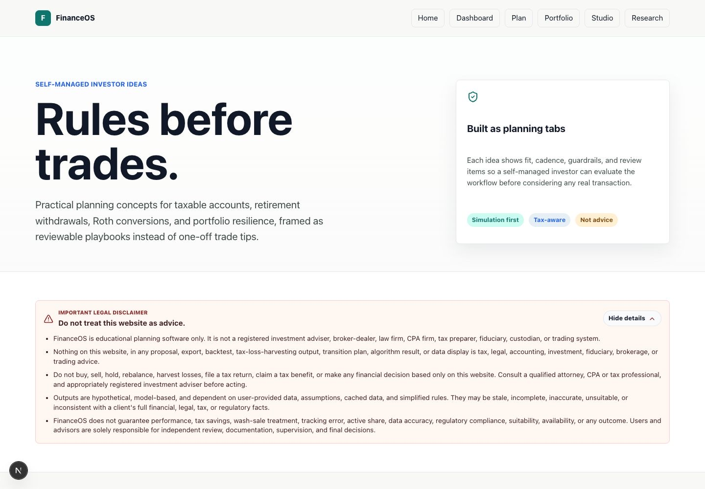

# personal_finance

Personalfinance is a simulation-only personal finance and advisor workflow platform for tax-aware direct indexing, tax-loss harvesting research, portfolio transition planning, 13F manager research, and retirement income analysis.

The product is designed to help users understand tradeoffs before taking action: tracking error versus tax-loss value, taxable account transitions versus embedded gains, Roth conversion windows versus future RMD pressure, and retirement spending needs versus portfolio durability.

> Important: DirectIndex is educational planning software only. It is not a registered investment adviser, broker-dealer, law firm, CPA firm, tax preparer, fiduciary, custodian, or trading system. Outputs are hypothetical and must not be treated as tax, legal, accounting, investment, fiduciary, brokerage, or trading advice.


## Product Modules

| Module | What it helps users do |
| --- | --- |
| Portfolio Dashboard | Build simulated direct-index portfolios, compare models, run backtests, review tax-loss harvesting candidates, and manage exclusions. |
| Advisor Workspace | Import a taxable legacy account, define transition constraints, produce proposal-ready transition plans, and export CSV recommendations. |
| Retirement Analyzer | Model retirement income, spending, tax-aware withdrawal order, Roth conversions, cash/bond/growth buckets, state taxes, and shortfall risk. |
| Ideas Workspace | Review self-managed investor playbooks for sector ETF TLH, asset location, retirement buckets, TIPS ladders, charitable giving, Roth windows, and rebalancing bands. |
| Research Center | Explain the methodology, tax-loss harvesting assumptions, wash-sale safeguards, model design, and source references in plain language. |
| 13F Research | Search investment managers, watch filings, download holdings, and simulate copycat performance from SEC 13F data. |

## Screenshots

### Portfolio Dashboard

The dashboard is the operational hub for direct-index simulation. Users can create a portfolio, choose a benchmark index, run backtests, compare direct-indexing models, import holdings and tax lots, and review TLH output before any real-world decision.


### Retirement Analyzer

The retirement analyzer combines account inputs, current income, retirement spending, tax assumptions, state details, Social Security, pension income, Natural Retirement Spending Smile, Roth conversion analysis, and withdrawal sequencing.


### Advisor Workspace

The advisor workspace focuses on taxable account transition proposals. It supports imported holdings, imported tax lots, client constraints, annual gain budgets, maximum tracking error, maximum active share, exclusion rules, and proposal export.


### Research Center

The research page explains the methodology behind the product so users can understand what the model is doing, where the assumptions come from, and why the output is still only a planning artifact.


### Ideas Workspace

The ideas workspace organizes self-managed investor concepts into reviewable tabs. Current playbooks include sector ETF tax-loss harvesting, core plus TLH sleeves, asset location, retirement buckets, TIPS ladders, charitable giving with DAF/QCD workflows, Roth conversion windows, and threshold-based rebalancing.



For a longer feature walkthrough, see [docs/USABILITY_GUIDE.md](docs/USABILITY_GUIDE.md).

## Core Capabilities

- Direct-index portfolio simulation for supported indices including `XLG`, `SPY`, `TOPT`, and `QTOP`.
- Tax-loss harvesting review in conservative, moderate, and aggressive modes.
- Direct-indexing model comparison:
  - Risk-score optimizer
  - Threshold throttle
  - Peer basket replacement
  - Completion ETF sleeve
- Backtests with benchmark comparison, tracking difference, tracking error, harvested losses, estimated tax impact, tax-adjusted result, trade count, cap usage, and warnings.
- Portfolio import workflow for holdings and tax lots.
- Advisor transition proposals with gain budgets, tracking constraints, active-share constraints, client exclusions, household wash-sale notes, and CSV export.
- SEC 13F workflow for manager search, watch creation, filing refresh, holdings download, and copycat performance simulation.
- Self-managed investor ideas workspace with:
  - Sector ETF tax-loss harvesting sleeve and replacement ETF examples
  - Asset location review across taxable, tax-deferred, Roth, and HSA-style accounts
  - Retirement cash, bond, and growth bucket planning
  - TIPS ladder income-floor planning
  - Charitable giving stack for appreciated securities, donor-advised funds, and QCD review
  - Roth conversion and threshold-based rebalancing playbooks
- Retirement planning workflow with:
  - Taxable, tax-deferred, Roth/HSA, and cash account inputs
  - Saved user inputs after login
  - Current income less federal and current-state tax until retirement
  - Natural Retirement Spending Smile projection
  - State and federal tax assumptions
  - Tax-aware withdrawal sequencing
  - Roth conversion amount, tax funding, and reasoning
  - Cash/T-bill, bond, and growth bucket guidance
  - Annual spending funding mix by stable income, taxable, tax-deferred, Roth, cash, and shortfall

## Tech Stack

- Frontend: Next.js, React, TypeScript, Recharts, Lucide icons
- Backend: FastAPI, SQLAlchemy, Pydantic, Argon2 password hashing
- Data and jobs: PostgreSQL, Redis, Celery
- Market and filing data: cached provider data with deterministic fallback data when providers are unavailable
- Local environment: Docker Compose

## Project Structure

```text
.
├── backend/                  FastAPI app, services, models, schemas, tests
├── frontend/                 Next.js app and shared API client
├── docs/
│   ├── USABILITY_GUIDE.md    Product walkthrough and demo guide
│   └── screenshots/          README and guide screenshots
├── docker-compose.yml        Local Postgres, Redis, backend, worker, beat, frontend
├── .env.example              Local environment template
└── README.md
```

## Clone or Fork

To run locally from GitHub:

```bash
git clone https://github.com/dakshk11/personal_finance.git
cd personal_finance
cp .env.example .env
docker compose up --build
```

Or fork the repository in GitHub first, then clone your fork:

```bash
git clone https://github.com/<your-username>/personal_finance.git
cd personal_finance
cp .env.example .env
docker compose up --build
```

## Quickstart

Requirements:

- Docker Desktop or a compatible Docker engine
- Docker Compose

Run the full local stack:

```bash
cp .env.example .env
docker compose up --build
```

Open:

- Frontend: http://localhost:3000
- Backend API docs: http://localhost:8000/docs
- Health check: http://localhost:8000/health

Local test account:

- Email: `test@gmail.com`
- Password: `1234`

The test account is seeded on backend startup when `SEED_TEST_ACCOUNT=true`. Disable this before using the project outside local development.

To stop the stack:

```bash
docker compose down
```

To stop the stack and remove local database/cache volumes:

```bash
docker compose down -v
```

## Environment Variables

Copy `.env.example` to `.env` before running Docker Compose.

| Variable | Purpose |
| --- | --- |
| `POSTGRES_DB` | Local Postgres database name |
| `POSTGRES_USER` | Local Postgres user |
| `POSTGRES_PASSWORD` | Local Postgres password |
| `DATABASE_URL` | Backend SQLAlchemy database URL |
| `REDIS_URL` | Redis URL for Celery jobs |
| `SESSION_COOKIE_SECURE` | Set `true` for HTTPS-only cookies in deployed environments |
| `FRONTEND_ORIGIN` | Allowed frontend origin for CORS |
| `NEXT_PUBLIC_API_URL` | API URL used by the Next.js frontend |
| `SEED_TEST_ACCOUNT` | Seeds the local test user when `true` |
| `TEST_ACCOUNT_EMAIL` | Local seeded test email |
| `TEST_ACCOUNT_PASSWORD` | Local seeded test password |

## Local Development Without Docker

Docker Compose is recommended because it starts Postgres, Redis, the API, Celery worker, Celery beat, and the frontend together.

Backend-only local run:

```bash
cd backend
python3.12 -m venv .venv
source .venv/bin/activate
pip install -r requirements.txt
uvicorn app.main:app --reload
```

Frontend-only local run:

```bash
cd frontend
npm install
NEXT_PUBLIC_API_URL=http://localhost:8000 npm run dev
```

If the backend is run without `DATABASE_URL`, it falls back to a local SQLite database. Background workflows still require Redis and Celery.

## Tests and Checks

Backend unit tests:

```bash
PYTHONPATH=backend python3 -m unittest discover backend/tests
```

After backend dependencies are installed, pytest can also run the suite:

```bash
PYTHONPATH=backend pytest backend/tests
```

Frontend typecheck:

```bash
cd frontend
npm run typecheck
```

Frontend production build:

```bash
cd frontend
npm run build
```

## Data Behavior

The backend caches holdings, daily prices, and SEC filing data. Where possible, it attempts free provider retrieval. If data is unavailable, throttled, stale, or incomplete, the app falls back to deterministic demo data and shows warnings so the UI remains usable.

Backtest and trade outputs are hypothetical. They depend on cached data, simplified assumptions, user inputs, and model rules. They should be reviewed as research artifacts, not implementation instructions.

## Security Notes

- Passwords are hashed with Argon2.
- Sessions use HTTP-only cookies.
- Local development defaults are intentionally simple and should be changed before any hosted deployment.
- Do not commit `.env`, database files, cache volumes, or private account data.

## Legal and Advice Disclaimer

DirectIndex is educational planning software only. It is not a registered investment adviser, broker-dealer, law firm, CPA firm, tax preparer, fiduciary, custodian, or trading system.

Nothing in the app, README, backtests, tax-loss-harvesting output, transition plans, retirement analyzer, exports, or data displays is tax, legal, accounting, investment, fiduciary, brokerage, or trading advice. Consult qualified professionals before making financial decisions.

## License

MIT. See [LICENSE](LICENSE).
