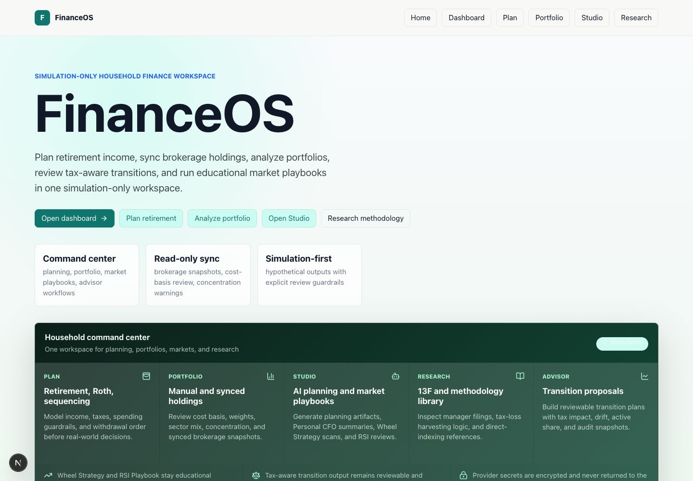
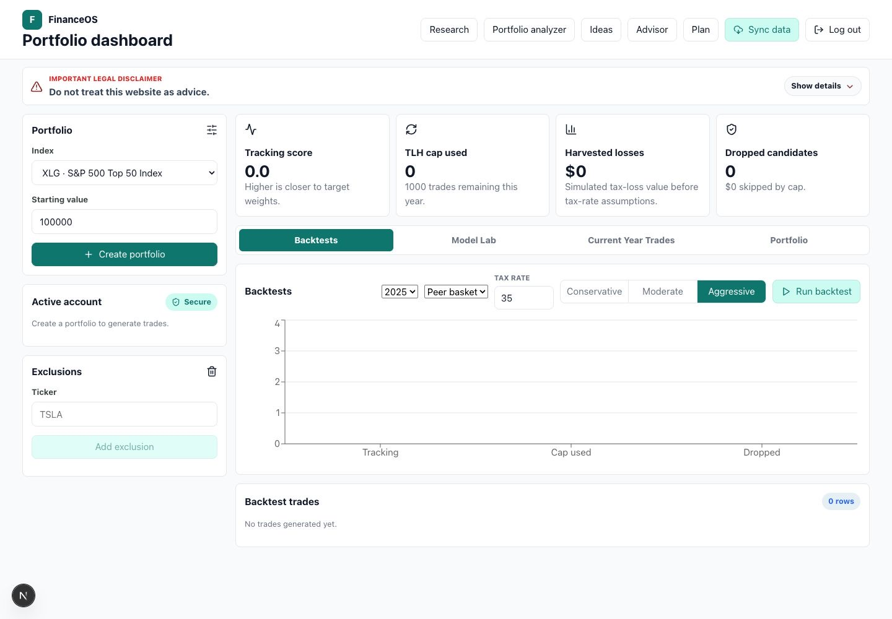
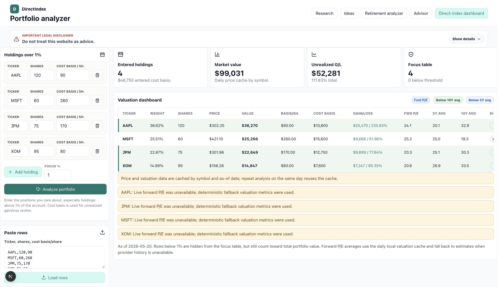
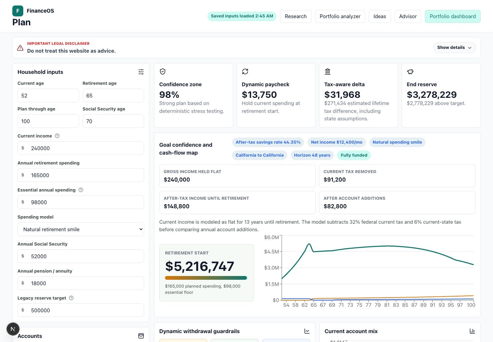
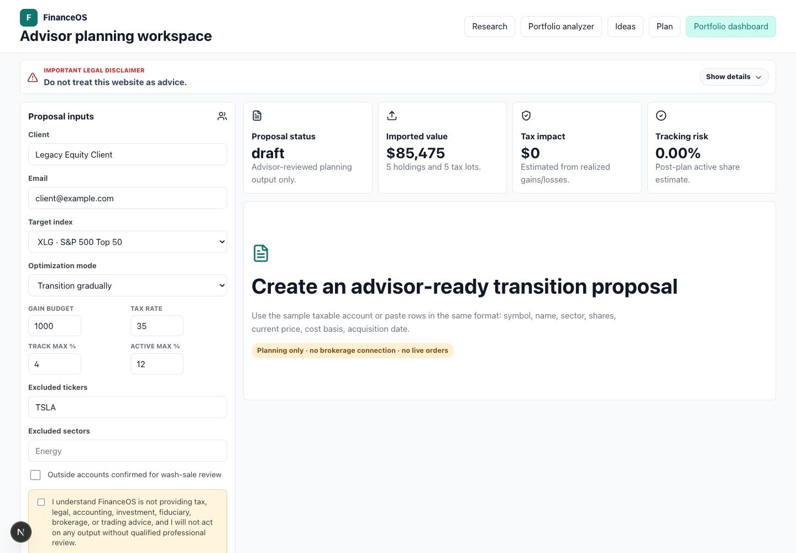
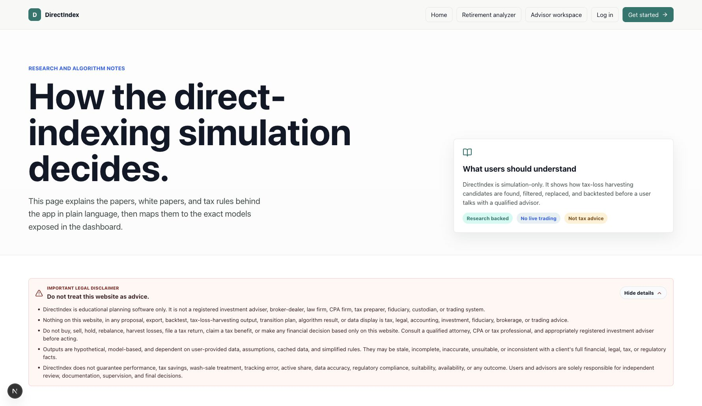

# FinanceOS Usability Guide

This guide is intended for product demos, user onboarding, and investor/customer-facing explanation. It describes the main workflows in plain language and maps each screen to the value it provides.

FinanceOS is simulation-only planning software. It does not provide tax, legal, accounting, investment, fiduciary, brokerage, or trading advice.

## Product Narrative

FinanceOS helps users and advisors answer practical planning questions before implementation:

- If I directly index an ETF or index, how much tracking drift might I accept?
- Which tax-loss harvesting model produces useful losses without creating operational noise?
- Which existing holdings have large embedded gains, high concentration, or valuation signals that deserve review?
- Which synced brokerage holdings have concentration, sector, cost-basis, or unrealized P/L issues that deserve manual review?
- Which stocks fall into the RSI playbook zones for cash, put-selling, stock-buying, or LEAP review?
- How should I transition a taxable legacy account without ignoring embedded gains?
- What does a retirement plan look like after state taxes, account type, Roth conversion windows, and spending changes?
- Which wheel-strategy candidates deserve further manual review based on option-chain, liquidity, volatility, earnings, and exposure guardrails?
- How can an AI-assisted interview turn messy personal financial context into a structured investor one-pager?
- How can users understand the research and assumptions behind the model before trusting the output?

## First Impression

The landing page positions the product as a household personal finance command center for planning, portfolios, market research, and advisor workflows while making clear that the product is simulation-only.

What to point out in a demo:

- The primary workflow is not generic budgeting. It is tax-aware portfolio, taxable transition, and retirement planning.
- The UI makes the simulation status visible.
- The main navigation exposes the product modules immediately: Home, Dashboard, Plan, Portfolio, Studio, and Research.
- Local development currently uses a shared demo workspace, so users can open modules without a login redirect.

## Portfolio Dashboard

The portfolio dashboard is the first operational workspace. In local development it loads through the shared demo user and is designed for repeated analysis by a user or advisor.

Primary user jobs:

- Create a simulated direct-index portfolio.
- Select the benchmark index.
- Run backtests by year, direct-indexing model, TLH mode, and tax rate.
- Compare tracking score, harvested losses, dropped candidates, and trade cap usage.
- Import holdings and tax lots for more realistic taxable-account analysis.
- Review exclusions and wash-sale-sensitive replacement logic before action.

Professional positioning:

- The dashboard is a review surface, not an execution blotter.
- Warnings stay visible so model limitations are part of the workflow.
- The app caps TLH output to keep recommendations operationally reviewable.

## Portfolio Analyzer

The portfolio analyzer is for users who already know their holdings and want a valuation, concentration, and tax-basis review without starting from a benchmark model.

Primary user jobs:

- Enter tickers, shares, and cost basis per share, especially for holdings above 1% of the account.
- Review daily market value, account weight, total cost basis, and unrealized gain/loss.
- Compare forward P/E against 5-year and 10-year forward P/E averages.
- Identify valuation signals such as below 5-year average, below 10-year average, or at/above historical averages.
- See whether each row used Stooq close data, yfinance data, deterministic fallback data, or a mixed source such as real price with fallback valuation metrics.

Professional positioning:

- The screen works for self-managed investors who do not want to use direct indexing but still want a disciplined review process.
- Cost basis is visible because tax consequences matter when a holding is trimmed, gifted, donated, or transitioned.
- Data-source labels are intentionally exposed so users can separate real daily close data from fallback valuation estimates.

## Retirement Analyzer

The retirement analyzer is built around user-entered household, account, income, tax, and spending assumptions.

Primary user jobs:

- Enter taxable, tax-deferred, Roth/HSA, and cash balances.
- Model current income as after-tax income until retirement.
- Add Social Security and pension income.
- Choose current state and retirement state tax assumptions.
- Project annual retirement spending with the Natural Retirement Spending Smile.
- Evaluate Roth conversion timing, suggested amount, tax funding, and reasoning.
- See annual spending funded by stable income, taxable, tax-deferred, Roth, cash, and any shortfall.
- Change how many detailed cash-flow rows are shown, with 36 rows as the default.
- Compare Roth conversion tax savings using the user's current effective tax rate and different conversion percentages.
- Add life events, family gifting goals, and estate-plan status to the planning context.
- Allocate reserves across cash/T-bills, bonds, and growth assets to reduce forced selling risk.

Professional positioning:

- The analyzer explains why the model makes a recommendation.
- Detailed reasoning is collapsible so the screen stays usable.
- Inputs are saved in the local workspace so the workflow can be revisited.

## Advisor Workspace

The advisor workspace supports a taxable legacy-account transition proposal.

Primary user jobs:

- Create a client planning record.
- Import current holdings and tax lots.
- Set target index, gain budget, tracking-error limit, active-share limit, tax rate, exclusions, and household notes.
- Generate transition recommendations.
- Review tax impact, drift, active share, assumptions, and warnings.
- Export proposal recommendations to CSV.

Professional positioning:

- The workflow separates analysis from implementation.
- The user must acknowledge the legal disclaimer before generating a proposal.
- Imported data and assumptions are part of the review record.

## FinanceOS Studio

FinanceOS Studio is a multi-tab workspace for OpenAI-assisted planning artifacts, read-only portfolio sync, and educational market research.

Primary user jobs:

- Save an encrypted user-owned OpenAI API key.
- Generate saved retirement-planning reports from complete planning inputs.
- Review prior AI report history.
- Open Personal CFO for a structured investor interview and one-pager workflow.
- Open Wheel Strategy for a daily educational option-chain scan and wheel lifecycle review.
- Open Portfolio Sync for read-only brokerage connection, account snapshots, holdings P/L, sector mix, and concentration review.
- Open RSI Playbook for a combined Wheel Strategy and Portfolio Sync stock list mapped to RSI/EMA action zones.

Professional positioning:

- The OpenAI key remains user-owned and encrypted before storage.
- AI output is saved as a planning artifact, not treated as final advice.
- Wheel Strategy output uses research-priority language and does not place orders.
- Portfolio Sync is read-only, uses SnapTrade when configured, and shows setup-required copy instead of fake broker data when credentials are missing.
- RSI Playbook action labels are rule outputs, not execution instructions.

## Personal CFO

Personal CFO is an AI-assisted interview workspace inside FinanceOS Studio. It is designed to gather qualitative and quantitative context before producing an investor one-pager.

Primary user jobs:

- Create or reopen an investment-folder project.
- Answer a seven-phase interview covering situation, capital, philosophy, behavior, preferences, goals, and stress tests.
- Edit project markdown files that capture memory, positioning, portfolio notes, and draft outputs.
- Paste or upload optional financial CSV content for dashboard summaries.
- Generate an investor one-pager after the interview is complete.
- Use one refinement round to improve the one-pager.

Professional positioning:

- The workflow encourages complete context before generation.
- Files remain editable so the user can correct or extend the project record.
- The dashboard summarizes cash trend, P&L, exposures, memory timeline, and open flags for review.

## Wheel Strategy

Wheel Strategy is an educational options-research workbench inside FinanceOS Studio. It scans a default universe of S&P 500 top holdings, Nasdaq top holdings, core ETFs (`QQQ`, `SPY`, `SMH`, `XLE`, `XLI`), and leveraged ETFs (`UPRO`, `TQQQ`, `SOXL`).

Primary user jobs:

- Run a daily scan for 30-45 DTE cash-secured put candidates.
- Review yfinance option-chain candidates when available, with deterministic fallback data clearly labeled if provider data fails.
- Compare candidate yield, delta, IV rank proxy, Bollinger Band %, earnings window, open interest, spread, score, and exposure usage.
- Use the Deep Dive Summary to decide which 1-5 symbols deserve manual research.
- Record accepted put candidates for lifecycle tracking.
- Track 50% profit alerts, assignment review, covered-call candidate alerts, and roll review eligibility.

Professional positioning:

- The screen is a research cockpit, not an order ticket.
- Candidate language avoids buy/sell instructions and uses research priority, candidate, review, and manually verify.
- Wheel lifecycle rules are conservative: profit review at 50%, covered-call review after assignment, and roll review only under 14 DTE when a positive net credit is available.
- More implementation detail is documented in [WHEEL_STRATEGY.md](WHEEL_STRATEGY.md).

## Portfolio Sync

Portfolio Sync is a read-only brokerage sync dashboard inside FinanceOS Studio. It uses SnapTrade to connect accounts and stores only provider identity, encrypted SnapTrade user secret, account metadata, and the latest holdings snapshot.

Primary user jobs:

- Connect brokerage accounts through SnapTrade when provider credentials are configured.
- See setup-required state when `SNAPTRADE_CLIENT_ID` or `SNAPTRADE_CONSUMER_KEY` is missing.
- Sync connected accounts and review account cards by brokerage/account.
- Review aggregate market value, cost basis, unrealized gain/loss, account count, and holding count.
- Inspect sector mix, top holdings P/L, holdings weights, and source labels.
- Review missing cost-basis warnings and concentration flags above 10% for single holdings or above 25% for sectors.
- Use the manual Portfolio Analyzer when SnapTrade credentials are not configured.

Professional positioning:

- The workflow is a visibility and review surface, not a trading interface.
- FinanceOS never handles broker credentials directly and does not expose order placement, rebalancing, or money movement.
- Synced holdings are valued through the existing Portfolio Analyzer pricing and valuation flow.
- More implementation detail is documented in [PORTFOLIO_SYNC.md](PORTFOLIO_SYNC.md).

## RSI Playbook

RSI Playbook is a technical-analysis workbench inside FinanceOS Studio. It combines symbols from Wheel Strategy and the latest Portfolio Sync holdings snapshot, then maps each stock to the requested RSI playbook action.

Primary user jobs:

- Review every stock from the Wheel Strategy universe and any synced holdings.
- See which zone each stock sits in: RSI 70+, 55-65, 45-55, 30-45, or 30 and below.
- Review the playbook action label for each symbol.
- Filter the summary table by cash, puts, stock, LEAP, or watch.
- Click a stock to open details with price, EMA 8/21/55, RSI bands, source labels, and data notes.

Professional positioning:

- The tab is a playbook visualization, not an order ticket.
- The rule engine leaves the unspecified 65-70 RSI band as a watch gap.
- The chart uses cached provider history when available and labels deterministic fallback chart data.
- More implementation detail is documented in [RSI_PLAYBOOK.md](RSI_PLAYBOOK.md).

## Research Center

The research center gives users context for the methodology and keeps assumptions visible.

Primary user jobs:

- Understand how tax-loss harvesting candidates are found.
- Learn why wash-sale safeguards matter.
- Compare executable models with research-only models.
- Review the plain-English rationale behind direct indexing and TLH assumptions.

Professional positioning:

- The product does not hide behind a black box.
- Research links and model notes help users understand limitations.
- Plain-language explanations support user trust without implying advice.

## Suggested Demo Flow

1. Start at the landing page and explain the simulation-only scope.
2. Open Research to establish methodology and user trust.
3. Open Dashboard and create or select a direct-index portfolio.
4. Run a backtest and compare TLH modes.
5. Open Portfolio Analyzer and show how entered holdings, cost basis, daily close data, unrealized gains, and valuation signals are reviewed.
6. Open Advisor Workspace and show how a taxable transition proposal is generated from imported lots and constraints.
7. Open Retirement Analyzer and show account inputs, state taxes, spending smile, Roth conversion reasoning, and the annual funding mix chart.
8. Open FinanceOS Studio and show the saved OpenAI key area, Personal CFO tab, Wheel Strategy tab, Portfolio Sync tab, and RSI Playbook tab.
9. In Wheel Strategy, show the universe chips, Deep Dive Summary, candidate table, checklist, and lifecycle cards.
10. In Portfolio Sync, show either the setup-required state or a synced brokerage snapshot with accounts, sector mix, P/L, and concentration flags.
11. In RSI Playbook, show the rule strip, per-stock summary, filters, and detail chart with price, EMA, and RSI.
12. End by reiterating that outputs are planning artifacts for professional review, not trade or tax instructions.

## Usability Principles

- Keep warnings close to the output they qualify.
- Preserve user-entered retirement assumptions in the local workspace.
- Use collapsible reasoning for advanced tax and retirement details.
- Prefer clear numbers, charts, and funding sources over broad summaries.
- Expose data-source labels when price and valuation data come from different providers or fallback estimates.
- Label fallback option-chain data clearly in Wheel Strategy.
- Show setup-required state instead of fake broker data in Portfolio Sync.
- Keep RSI Playbook rule labels close to chart context and manual verification notes.
- Make the distinction between simulation and implementation unavoidable.
- Keep product copy professional, specific, and conservative.

## Current Limitations

- The app is designed for local development and demonstration.
- Login is currently disabled for local development; the backend falls back to a shared demo user when no valid session exists.
- Data can fall back to deterministic demo values when providers are unavailable or throttled.
- Portfolio Analyzer rows can mix sources, such as Stooq daily close prices with fallback forward P/E estimates.
- Wheel Strategy depends on yfinance option-chain availability and may show deterministic fallback contracts for educational review.
- Portfolio Sync requires SnapTrade credentials for live read-only brokerage connection; without credentials, users should use the manual Portfolio Analyzer.
- RSI Playbook depends on daily market-history availability and can show deterministic fallback chart data when providers are unavailable.
- Tax and retirement calculations use simplified assumptions.
- Retirement analyzer output is deterministic, not a Monte Carlo engine.
- No live trading, custody, tax filing, or brokerage execution is provided.

## Local Demo Workspace

When `SEED_TEST_ACCOUNT=true`, the backend seeds the local demo user:

- Email: `local-demo@financeos.local`
- Password: no reusable default is documented or committed. If `TEST_ACCOUNT_PASSWORD` is blank or unset, the backend generates an in-memory random local password at startup.

The UI currently uses the shared local workspace without requiring a login form. Restore strict authentication and disable demo defaults before using any non-local environment.
